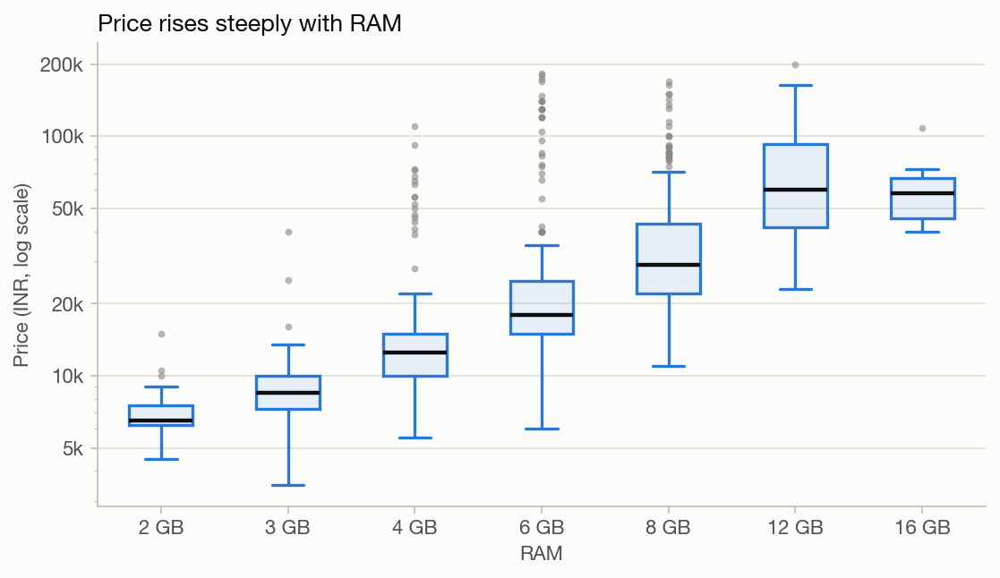
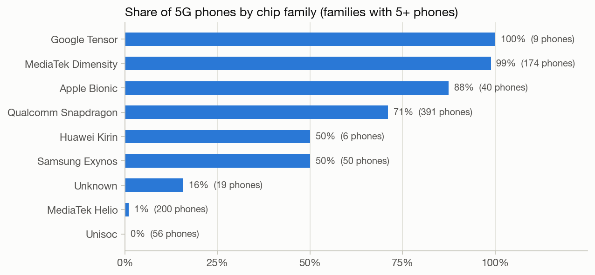
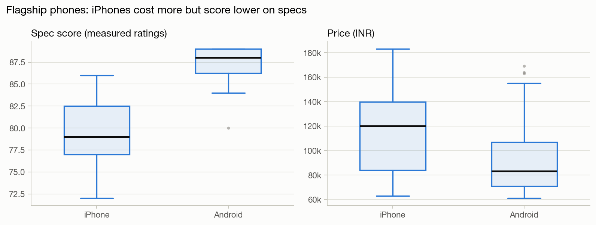
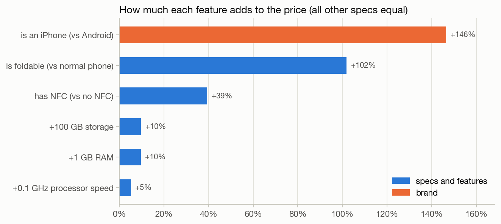
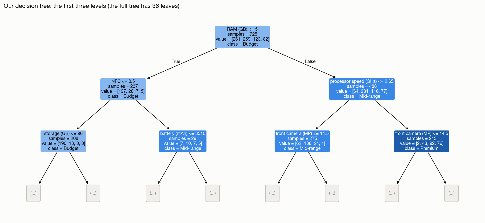
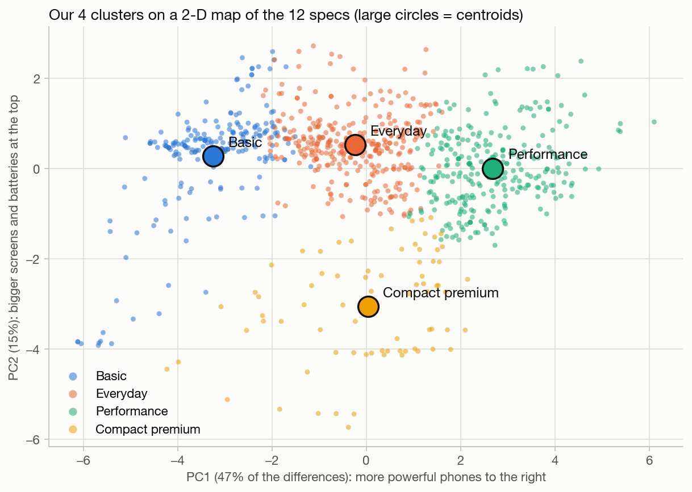

# Smartphone Market Analysis

What drives the price of a smartphone, and which phones get 5G? In this project we analyse **980 smartphones listed in 2023 on Smartprix**, an Indian price-comparison website: we clean the raw data (907 real phones remain), explore it, test hypotheses, build regression and decision tree models, and group the phones into types with clustering.

We made this project as a team of two at the **T4EU Data Science Winter School** in Katowice, Poland.



## Dataset

We use the [Smartphones dataset](https://www.kaggle.com/datasets/informrohit1/smartphones-dataset) from Kaggle (MIT license), collected from the Indian comparison site Smartprix. It has 980 phones and 26 columns: price in rupees (₹), rating, chip, RAM, storage, battery, charging, screen, cameras, 5G, NFC and more.

## Progress

| Task | Topic | Notebook |
|---|---|---|
| 1 | Data preprocessing and exploratory data analysis | [Task1_Preprocessing_EDA.ipynb](Task1_Preprocessing_EDA.ipynb) ✅ |
| 2 | Hypothesis testing: one-sample, two-sample and chi-square tests | [Task2_Hypothesis_Testing.ipynb](Task2_Hypothesis_Testing.ipynb) ✅ |
| 3 | Linear and logistic regression | [Task3_Regression.ipynb](Task3_Regression.ipynb) ✅ |
| 4 | Classification with decision trees | [Task4_Decision_Trees.ipynb](Task4_Decision_Trees.ipynb) ✅ |
| 5 | Clustering with k-means and hierarchical clustering | [Task5_Clustering.ipynb](Task5_Clustering.ipynb) ✅ |

## Task 1 in short

- **Missing values** in 10 columns: we dropped the half-empty memory-card column, treated "no fast charging" (0 W) differently from "power unknown", and filled the missing ratings using phones in the same price group.
- **Cleaning:** we removed 66 phones that were never released (rumours, concepts and cancelled phones such as the "Tesla Pi Phone", the "iPhone 14 Mini" or the "Galaxy S22 FE"; we checked every suspicious name on Smartprix), 3 duplicates and 4 luxury editions. We corrected 3 wrong 5G labels (e.g. the iPhone 15) and merged inconsistent chip and brand names. 907 phones remain.
- **Outliers:** we compared the z-score and IQR methods. The IQR method flags far more phones, because half of all phones have exactly 5,000 mAh. We kept the real extremes and log-transformed the price.
- **New features:** we added the price in euros, a price segment, the chip maker, the pixel density and a foldable flag.
- We listed every change between the raw and the clean file in [data/changes_log.csv](data/changes_log.csv).

## What we found in Task 1

- A typical phone costs **₹19,499 (about €217)**. 5G phones have a median price of ₹29,999, against ₹12,490 for 4G-only phones.
- **Processor speed** is the strongest single predictor of price (r = 0.81 with log price), followed by rating (0.74) and RAM (0.69).
- **55% of phones have 5G**, but only 13% of budget phones against 94% of premium ones. MediaTek Dimensity chips are 99% 5G, Helio chips only 1%.



## Task 2 in short

Do you pay for the specs or for the brand? We tested six hypotheses at α = 0.05:

| Test | Our question | What we found |
|---|---|---|
| One-sample t-test | Is the average battery 5,000 mAh? | **No:** the mean is 4,810 mAh (p < 0.001), although 5,000 mAh is the most common size. |
| One-sample test for a proportion | Can most phones pay contactlessly (NFC)? | **No:** only 39% of phones have NFC (p < 0.001). It's a premium feature: 4% of budget phones vs 97% of flagships. |
| Two-sample t-test (Welch) | Do iPhones have better specs than Android flagships? | **No, the opposite:** spec score 79.5 vs 87.4 (p < 0.001), while iPhones cost more. |
| Two-sample t-test (Welch) | Is a flagship worth twice the price? | **Hardly:** Android flagships cost more than twice as much as Premium phones (€922 vs €444) but score only 2.3% higher (p < 0.001). |
| Chi-square test of homogeneity | Do the five biggest brands follow the same price strategy? | **No:** Realme sells mostly budget phones and no flagships, Samsung has the most flagships (p < 0.001). |
| Chi-square test of independence | Does 5G depend on the brand? | **No:** 47–58% for every brand (p = 0.54). 5G depends on the price instead. |

Our answer: for most phones you pay for the specs, but the extra money buys less and less at the top. iPhones are the exception, where you also pay for the brand.



## Task 3 in short

We built two models and tested them on 182 phones that they had not seen during training (20% of the data).

| Model | Our question | What we found |
|---|---|---|
| Multiple linear regression for log(price) | What drives the price of a phone? | Processor speed, RAM, storage, NFC, being an iPhone and being foldable all raise the price (all p < 0.001). On new phones, the model explains 83% of the variation in log price, and its average error is €81 (25% of the price). |
| Binary logistic regression for 5G | Which phones get 5G? | The chance of 5G rises with the price, the processor speed and the screen refresh rate (all p < 0.01). On new phones, the model is right 86% of the time, with an F1-score of 0.87 and a ROC-AUC of 0.94. |

With exactly the same specs, **an iPhone costs 2.5 times as much as an Android phone**, and a foldable 2.0 times as much.



## Task 4 in short

Can a decision tree tell a phone's price segment (Budget, Mid-range, Premium or Flagship) from its specs alone? We compared trees of different depths (4a) and with different numbers of phones per leaf (4b) using cross-validation, and chose a **small tree that we can read and explain**: depth 4, the point where more depth stops paying off.

- **Our tree** has only 15 leaves and asks at most 4 questions per phone. It puts **79.7% of the test phones** in the right segment (always answering "Budget" would give 35.7%), with a macro F1-score of 0.81. Over 20 random splits it averages 75%.
- **All mistakes but one are between neighbouring segments**, and **RAM and processor speed** make up 62% of the tree's decisions.
- **Decision rules** (the optional part): 14 rules from the tree plus a default rule reach 78.6% accuracy with 2.9 conditions per rule. For example: *4 GB of RAM or less without NFC means Budget*, and *a fast processor with a big screen means Flagship*.



## Task 5 in short

Which types of phones are there, if we look only at their specs? We clustered the phones with **k-means** on 12 specs, without the price. We tried k = 1 to 10 and chose **k = 4** with the **Elbow method** (after k = 4, each extra cluster lowers the WCSS by less than 9%) and the **silhouette** (the best for k ≥ 3: 0.235).

| Cluster | Phones | Median price | What its centroid looks like |
|---|---|---|---|
| Basic | 209 | €105 | slow, little RAM and storage, almost never 5G or NFC |
| Everyday | 340 | €189 | the typical phone: about 6 GB of RAM, half of them with 5G |
| Performance | 283 | €411 | fast, about 9 GB of RAM, 120 Hz screens, 5G and NFC |
| Compact premium | 75 | €622 | small screens and batteries, but fast and sharp, with NFC |

- k-means never saw the price, yet **the four types are ordered by price**. Still, they are types, not price levels: Performance phones cost anything from €189 to €2,033.
- **k-means found the iPhones without seeing the brand**: 32 of the 40 iPhones are in Compact premium.
- **Hierarchical clustering (AHC, Ward's method)** finds the same four types (adjusted Rand index 0.58), and its first split separates the Basic phones from all others.



## How to run

```bash
pip install -r requirements.txt
jupyter notebook
```

Run the notebooks in order. Task 1 creates `data/smartphones_clean.csv`, which Tasks 2 to 5 use. Each notebook also saves its charts in `figures/`.

## Project structure

```
├── Task1_Preprocessing_EDA.ipynb    Task 1: cleaning and EDA
├── Task2_Hypothesis_Testing.ipynb   Task 2: hypothesis testing
├── Task3_Regression.ipynb           Task 3: linear and logistic regression
├── Task4_Decision_Trees.ipynb       Task 4: classification with decision trees
├── Task5_Clustering.ipynb           Task 5: clustering with k-means and AHC
├── data/
│   ├── smartphones_cleaned_v6.csv   raw data from Kaggle
│   ├── smartphones_clean.csv        clean data, the output of Task 1
│   └── changes_log.csv              every change between the two files
├── figures/                         charts used in the presentation
└── requirements.txt
```
